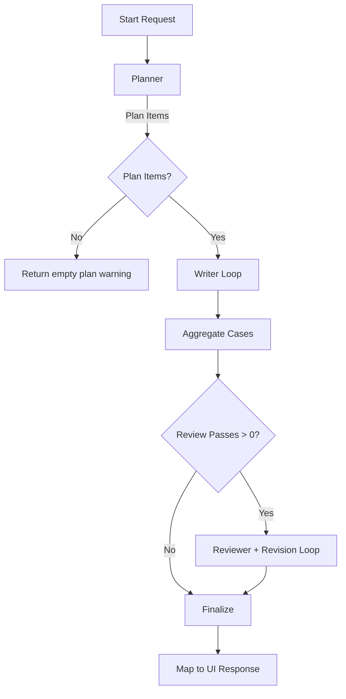

# Agentic Test Case Generation Workflows

This note documents how the agentic pipeline behaves end-to-end, including which LLM calls fire in each stage, how review passes trigger additional work, and what to expect for common mode / priority combinations. A Mermaid diagram is provided to visualize control flow.

## 1. High-Level Overview

### Stages and Calls

| Stage | LLM Calls | Notes |
|-------|-----------|-------|
| Planner | 1 per request (plus at most 1 retry on malformed JSON) | Uses a QA-strategist prompt that summarizes requirements/files, enforces focus length limits, and asks for JSON plan items (`id`, `title`, `area`, optional `focus`, `estimatedCases`, `chunkRefs`). |
| Writer | 1 per plan item (plus optional retry) | Each item yields a JSON array of cases matching the selected mode, now grouping closely-related checks into a single case where practical to reduce duplication. |
| Reviewer | Up to _maxReviewPasses_ calls (each may retry once) | Produces structured feedback. |
| Revision | One call per reviewer pass that has blocking feedback | Only executes if reviewer returns `major`/`critical` items. |

Internally the pipeline clamps retries to 1 additional attempt if the response isn’t valid JSON—after the second failure the stage aborts with a warning.

## 2. Mode and Priority Workflows

| Mode | Priority | Planner Output | Writer Emphasis | Reviewer Focus |
|------|----------|----------------|-----------------|----------------|
| `high-level` | `comprehensive` | Broad functional areas with rich coverage hints | Generate scenario-level cases spanning happy, alternate, and edge paths | Ensure gaps across areas / negative paths are covered |
| `high-level` | `core-functionality` | Focused on mission-critical flows | Prioritize golden paths and critical business checks | Verify essentials only |
| `detailed` | `comprehensive` | Break down by feature area; expected case count is higher | Full steps, preconditions, datasets, expected results | Finds missing edge steps / negative data |
| `detailed` | `core-functionality` | Planner highlights core user journeys | Writer generates compact but executable cases | Reviewer ensures essential validations exist |

### Call Count Examples

Assume planner returns _N_ plan items and you configure _R_ review passes.

| Workflow | Planner Calls | Writer Calls | Reviewer Calls | Revision Calls (max) |
|----------|---------------|--------------|----------------|-----------------------|
| High-level & comprehensive, no review | 1 | N | 0 | 0 |
| High-level & comprehensive, 1 review pass | 1 | N | ≤1 | ≤1 |
| Detailed & comprehensive, 2 review passes | 1 | N | ≤2 | ≤2 |
| Detailed & core, no review | 1 | N | 0 | 0 |

> _Note_: If a reviewer pass returns only `info`/`minor` items, the revision call is skipped. The reviewer loop stops early when blocking issues disappear or when the requested pass limit is reached.

## 3. Example Scenario

**Inputs**

- Mode: `high-level`
- Priority: `comprehensive`
- Provider: Gemini `gemini-1.5-pro`
- Agentic options: enabled, 1 review pass
- Requirements: “Customer login & MFA” document (plus 1 uploaded PDF)

**Execution**

1. **Planner** – Single call produces 5 plan items (Authentication, MFA, Recovery, Security Controls, Performance). The underlying prompt positions the model as an expert QA strategist, mentions the requested priority (`comprehensive`), limits focus/notes length, and requires a JSON array so token cleanup and validation succeed.
2. **Writer** – Five calls, one per plan item. The writer decides how many scenarios each slice should contain, guided by the planner’s optional `estimatedCases` hint and the priority mode. Duplicates are normalized; warnings emit if IDs collide.
3. **Reviewer (Pass 1)** – Reviews all aggregated scenarios. Returns two `minor` suggestions and one `major` gap (missing UI validation case). Because there is a major item, the loop continues.
   - _Major feedback example_: reviewer flags plan item `PLAN-2 (Recovery)` with `caseId: REC-LGN-004` severity `major`, summary “No scenario covers disabling self-service reset for locked accounts.”
4. **Revision** – One writer call referencing the reviewer’s suggestions regenerates only the affected cases.
   - The revision prompt is sent to the writer with the blocking feedback payload. The writer emits an updated array containing a rewritten `REC-LGN-004` and, if necessary, any additional cases requested by the reviewer. Existing unaffected cases are left as-is.
5. **Finalize** – Telemetry records total duration, writer slice stats, review feedback. UI shows planner cards, reviewer notes, warnings (e.g., duplicate ID overwritten).

**Total LLM Calls**: 1 (planner) + 5 (writer) + 1 (reviewer) + 1 (revision) = **8**.

## 4. Error Handling & Retries

- All structured calls (`generateObject`) use a `safeGenerateObject` wrapper that:
  1. Attempts the call.
  2. If the provider returns invalid JSON, tries to clean the text and validate via Zod.
  3. If still invalid, reissues the request with a strict “JSON only” instruction appended.
  4. Failing twice surfaces a warning; the pipeline continues with available data (empty plan, skipped slice, etc.).
- Single-shot mode (agentic disabled) still issues one `generateText` call; telemetry captures duration and case count but skips plan/reviewer data.

## 5. Quick Reference

| Configuration | LLM Call Graph |
|---------------|----------------|
| Agentic disabled | Single writer call (fallback single shot) |
| Agentic enabled, review passes = 0 | Planner → Writer loop → Finalize |
| Agentic enabled, review passes = R ≥ 1 | Planner → Writer loop → Reviewer × up to R → Revision × (passes with blocking issues) → Finalize |

## 6. Suggested Usage Patterns

- Use **high-level + comprehensive** to produce scenario catalogs for backlog grooming. Enable 1 review pass to get coverage suggestions quickly.
- Use **detailed + comprehensive** when you need executable test cases. Set review passes to 2 for safety-critical domains; expect more LLM calls proportional to plan size.
- Use **core-functionality** priorities to keep runs fast; planner emits fewer items, so writer call count drops.
- If provider rate limits allow, increase **writer concurrency** (1–6) to expand plan items in parallel. Expect slightly higher duplicate risk—the pipeline deduplicates automatically but may emit warnings.
- Planner, writer, and reviewer models can be overridden independently. Each dropdown mirrors your quick-select presets, so you can mix fast/cheap planners with high-quality writers or reviewers as needed.

## 7. Future Enhancements (Ideas)

- Persist planner output keyed by requirement hash to skip regeneration when artifacts haven’t changed.
- Stream stage telemetry to the UI in real time (currently summarized after completion).
- Allow reviewer to use a different provider/model per pass for cross-model validation.

---

_Last updated: 2025-09-28_
